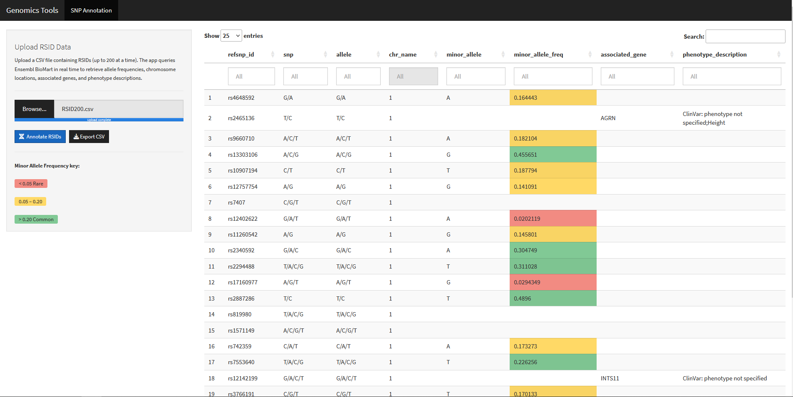

# Genomics Tools — SNP Annotation App


## Overview

The Genomics Tools SNP Annotation App is an interactive R Shiny application that queries the Ensembl BioMart database in real time to annotate a user-provided list of Reference SNP IDs (RSIDs) with clinically and biologically relevant metadata. For each RSID, the app retrieves the reference allele, observed alleles, chromosome location, minor allele identity, minor allele frequency (MAF), associated gene name, and linked ClinVar phenotype descriptions — all without requiring the user to write a single line of code. Results are presented in a color-coded, searchable, and filterable data table, with a one-click option to export the annotated dataset as a CSV file for downstream analysis.

---

## Screenshot



---

## Features

- Real-time RSID annotation via Ensembl BioMart (`biomaRt`)
- Color-coded Minor Allele Frequency column (rare / intermediate / common)
- Per-column filter inputs and global search bar powered by `DT`
- One-click CSV export of the full annotated result set
- Clean, responsive UI built with `shinythemes` (Cosmo)

---

## Requirements

**R version:** R ≥ 4.0.0

### CRAN packages

```r
install.packages(c("shiny", "shinythemes", "data.table", "RCurl", "DT"))
```

### Bioconductor packages

```r
if (!require("BiocManager", quietly = TRUE)) install.packages("BiocManager")
BiocManager::install("biomaRt")
```

---

## How to Run

1. Clone or download this repository.
2. Open R or RStudio and set your working directory to `R_SHINY_PROJECTS/`.
3. Install all required packages listed above.
4. Launch the app:

```r
shiny::runApp("INT_GENEVIEW_NGX.R")
```

Or open `INT_GENEVIEW_NGX.R` in RStudio and click **Run App**.

> **Note:** The app makes live API calls to the Ensembl REST endpoint. An active internet connection is required. Batches of ≤ 200 RSIDs per query are recommended to stay within Ensembl rate limits and keep response times reasonable.

---

## Input Format

The app expects a plain CSV file with RSIDs in the first column, one per row. A header row is accepted but not required.

**Example `rsids.csv`:**

```
rs429358
rs7412
rs1801133
rs1799945
rs334
```

---

## Sample Use Case

A researcher has completed a genome-wide association study (GWAS) and wants to rapidly characterize the top 150 candidate SNPs before drafting a variant report. They export the RSID list from PLINK as a CSV, upload it to this app, and click **Annotate RSIDs**. Within seconds the table populates with chromosome positions, population-level minor allele frequencies, nearest gene names, and any ClinVar or OMIM phenotype associations. The researcher uses the per-column filter on `phenotype_description` to isolate SNPs with documented disease relevance, then exports the filtered table as a CSV for direct inclusion in the manuscript supplement.

---

## Output Columns

| Column | Description |
|---|---|
| `refsnp_id` | RSID identifier (e.g., `rs429358`) |
| `snp` | SNP string from Ensembl |
| `allele` | Observed allele(s) at the locus |
| `chr_name` | Chromosome |
| `minor_allele` | Minor allele nucleotide |
| `minor_allele_freq` | Minor allele frequency — color-coded (see key below) |
| `associated_gene` | Nearest or overlapping gene symbol |
| `phenotype_description` | ClinVar / OMIM phenotype annotation(s) |

---

## MAF Color Key

| Color | MAF Range | Interpretation |
|---|---|---|
| Red | < 0.05 | Rare variant |
| Yellow | 0.05 – 0.20 | Low-frequency variant |
| Green | > 0.20 | Common variant |

---

## Project Structure

```
R_SHINY_PROJECTS/
├── INT_GENEVIEW_NGX.R     # Main Shiny application
├── GENE_VIEWER.R          # CSV genomics data explorer
├── Shiny_NeuReGen_Gx.R    # NeuReGx genomic testing form
├── ML-based web app.R     # Random Forest golf predictor (demo)
├── RSID200.csv            # Example RSID input file
└── README.md              # This file
```

---

## Author

**Fabian Alvarez-Primo**
[github.com/fabzy4L](https://github.com/fabzy4L)

---

*Built with R, Shiny, and Bioconductor biomaRt. Variant data sourced live from Ensembl (ensembl.org).*
